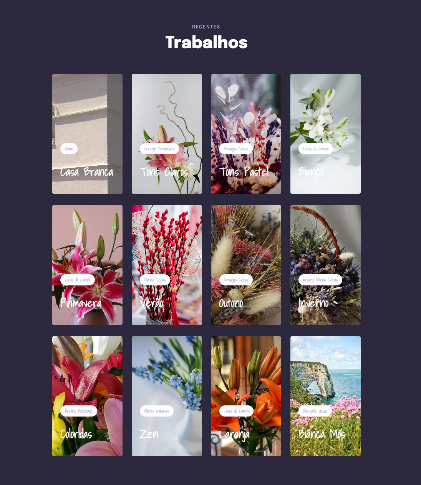
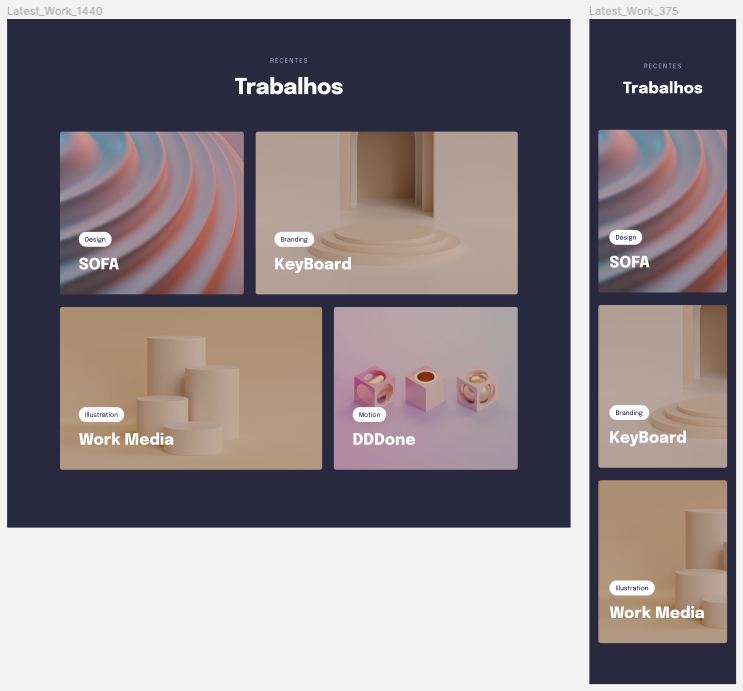
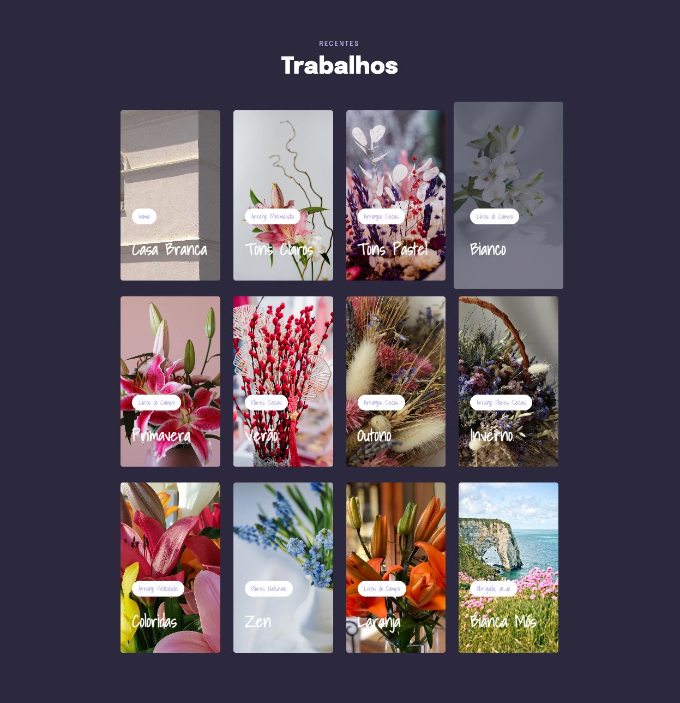
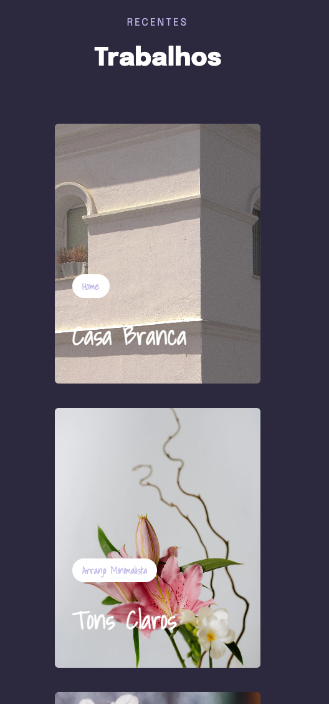

# 🌺 Componente Trabalhos - Site: "Arranjos Exclusivos"
🍃 _Component Works - Website: "Exclusive Arrangements"_

# 🚀 Objetivo:
_Objective:_

🇧🇷 Avançar mais com à responsividade de componentes e ajustes como animações e estilização do CSS.  

🇺🇸 _Go further with component responsiveness and tweaks like animations and CSS styling.._

📸   
 Captura de tela Desktop, do Projeto:
 
 _Desktop Screenshot, Project:_

#  Techonogias:
_Technology:_

- [HTML](../index.html)
- [CSS](../css.html)
- [Figma](https://www.figma.com/file/L5uZqEN3X2iuOYKhMh7Lnh/Explorer-Stage-03-Projeto-03-(Copy)?node-id=203-1865&t=Zc7xmpOTZpX7X0bW-0)

# 👩🏻‍💻 Componente trabalhos:
_Component Jobs:_  

📸 Captura de tela da inspiração via Figma / Rocketseat:  
Inspiration screenshot via Figma / Rocketseat:

📸 Capturas de telas do meu projeto final, via iPad Pro: 
 
_Screenshots of my final project, via iPad Pro_

📱 Screenshot iPhone 12 Pro:

#
## 💡 Projeto:
 _Project:_

🇧🇷 Foi desenvolvido com base nas aulas da Turma 09 Explorer Rocketseat.  

🇺🇸 _Made in Rocketseat's course Explorer._
#
### 🗓 Abril de 2023
 _April 2023_ 
#
 ### 🔗 Link: 
 🇧🇷 [Projeto online aqui!](http://127.0.0.1:5500/index.html)
   
 🇺🇸 [_Project online here!_](http://127.0.0.1:5500/index.html)

 #
                    Feito com 🌼 by BM